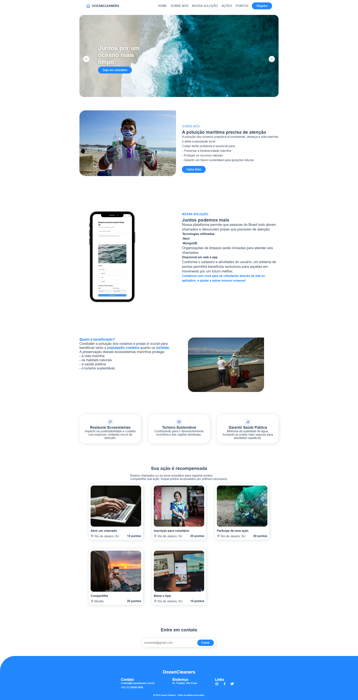

# Blue Future

Inspirado no Oceans 20, um grupo de engajamento com foco em questões como financiamento para a Economia Azul e gestão sustentável dos oceanos, o Blue Future busca por soluções inovadoras para solucionarem problemas relacionados à poluição, gestão, monitoramento de habitats marinhos, etc.

<p align="center">
  
</p>

# Projeto

O Ocean Cleaners é uma plataforma que visa conectar equipes de limpeza e a população para ajudar a manter a limpeza dos oceanos.
Por meio de chamados abertos pela população, equipes voluntárias são direcionadas aos locais que mais necessitam de limpeza.
Tanto os voluntários quanto os usuários que reportam são recompensados com pontuação na nossa plataforma que, posteriormente, poderá ser trocada por prêmios.

# Tecnologias

- HTML5
- CSS3

# Como rodar

Clone o repositório utilizando

```sh
$ git clone https://github.com/OceanCleaners/OceanCleaners-Python.git
```

Na pasta do repositório, abra o arquivo index.html

# Motivação

Se trata da avaliação semestral (Global Solution) para os componentes `Front-end Design` e `Web Development`, ministrados pelos professor Lucas Silva e Caio Oliveira, respectivamente.

# Membros

- Alex Maia (RM 557356)
- Marcos Ferreira (RM 556228)
- Mayla Maricato (RM 557754)

# Imagens do Projeto
O projeto também pode ser acessado [clicando aqui](https://oceancleaners.github.io/OceanCleaners-Front-End/)

### Página Inicial


### Registro
